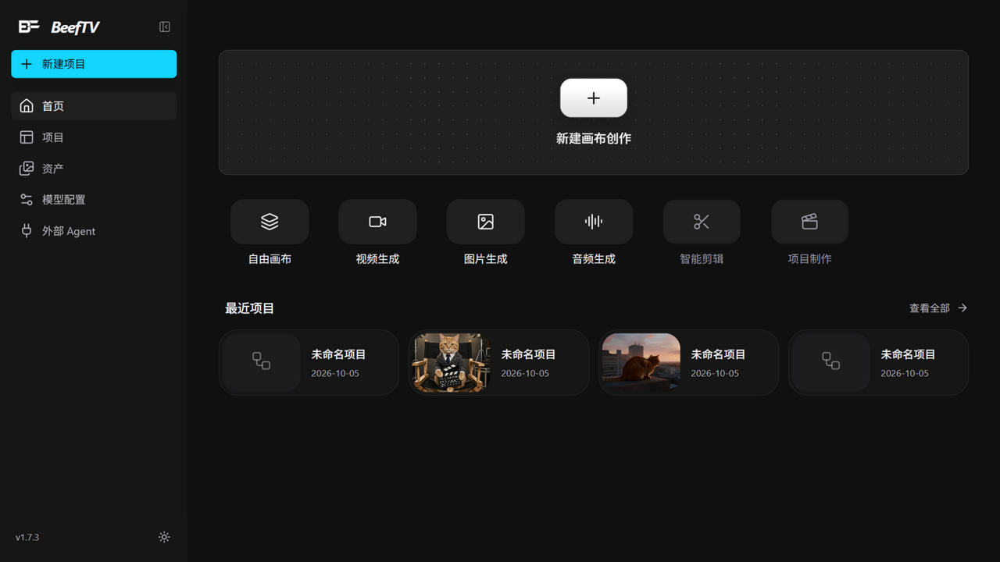
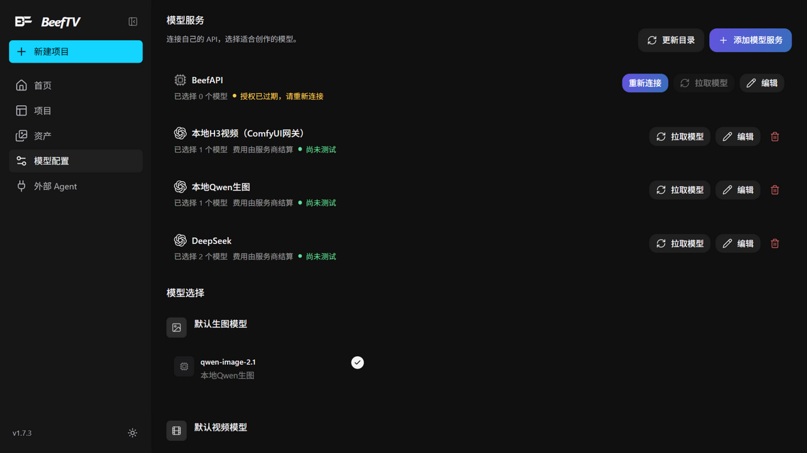
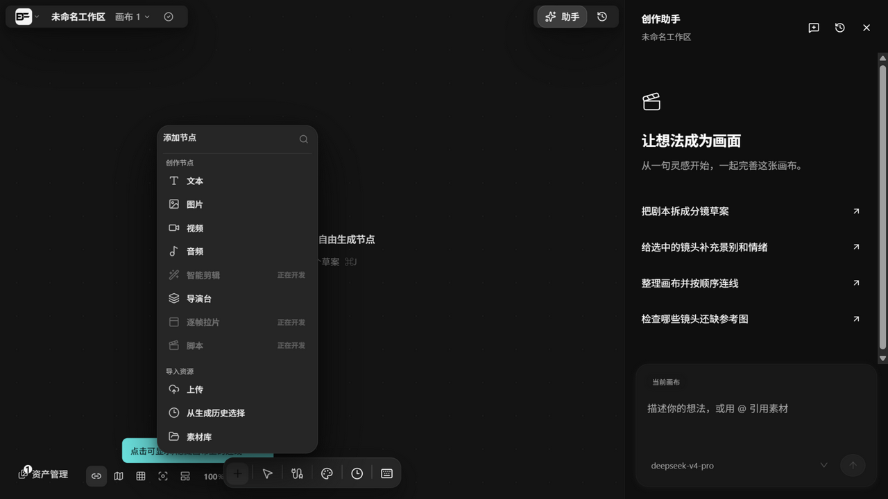
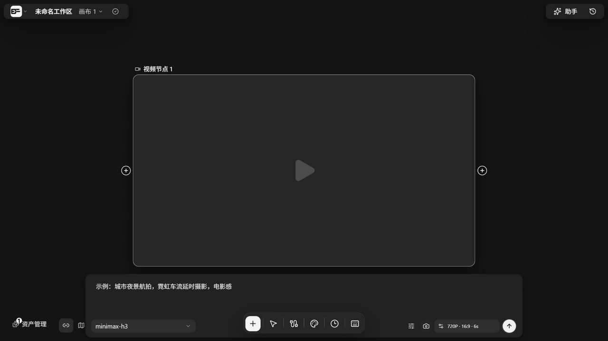
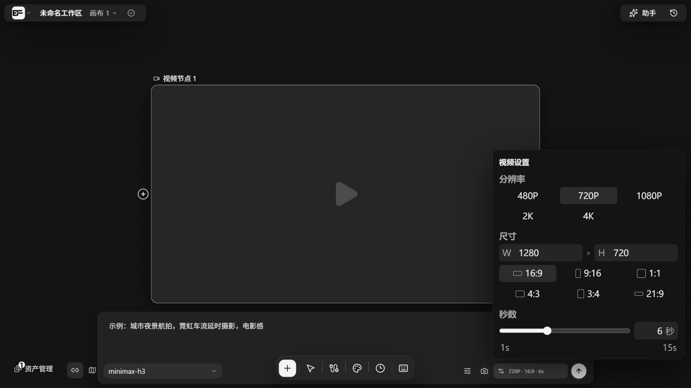
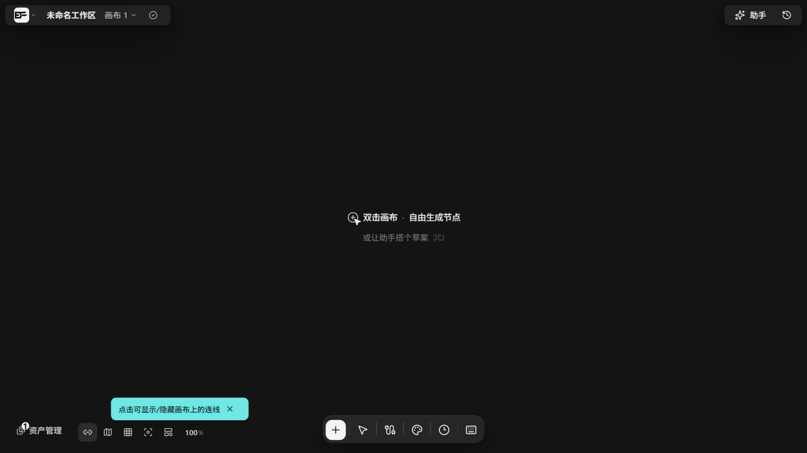
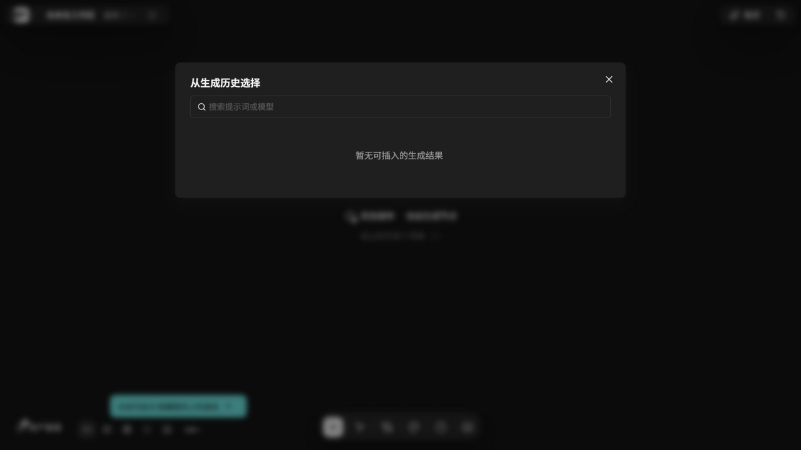
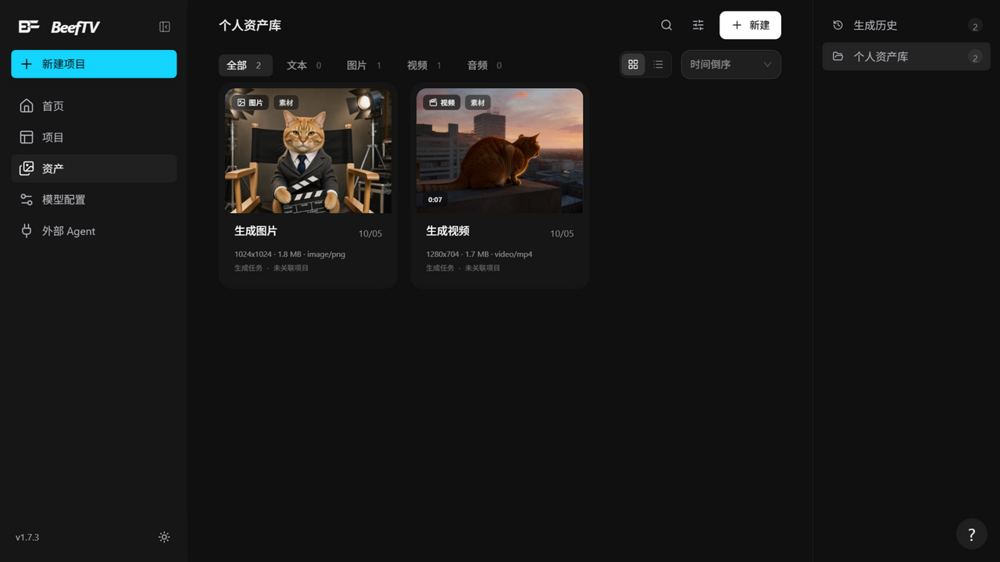
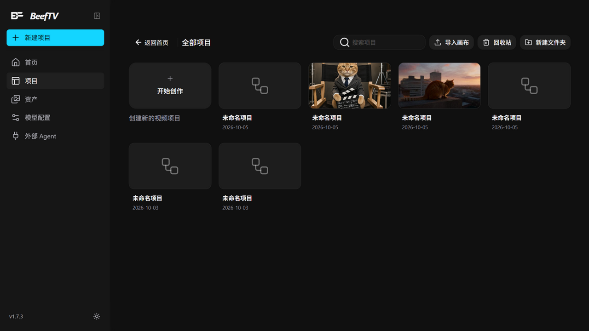

# BeefTV 本地操作手册

> 适用环境：本机（Windows · RTX 5060 Ti 16GB）的开发部署形态，配套 DeepSeek 云端文本 + Qwen-Image-2.1 本地生图 + MiniMax-H3 本地视频。
> 截图见 `local/manual-assets/`，下文以  内嵌。
> 更新日期：2026-10-05（对应官方 v1.7.3 + 本地扩展）。

---

## 目录

1. [这套系统是什么](#一这套系统是什么)
2. [启动与关闭](#二启动与关闭)
3. [界面导览](#三界面导览)
4. [模型配置](#四模型配置)
5. [画布完全指南](#五画布完全指南)
6. [生成工作流与性能](#六生成工作流与性能)
7. [创作助手](#七创作助手)
8. [生成历史 / 素材库 / 项目库](#八生成历史--素材库--项目库)
9. [辅助功能](#九辅助功能)
10. [数据位置与备份](#十数据位置与备份)
11. [故障排查](#十一故障排查)
12. [附录：快捷键 / 端口 / 命令](#十二附录)

---

## 一、这套系统是什么

BeefTV 是一个**本地优先的 AI 视频创作工作台**：核心是自由画布，把提示词、参考图、生成结果组织成节点和连线，从灵感到成片一条链路。

你这套环境的完整架构：

```text
浏览器 http://localhost:3000（Vite 开发服务器）
   │  /api 请求经 Vite 代理（指向 owner 信任代理）
   ▼
owner 信任代理 :8090（注入本机 owner 凭据，画布保存需要）
   ▼
BeefTV 后端 :8080（Go · 数据库 · 任务系统 · 助手宿主管理）
   ├── 文本 → DeepSeek 云端 API（deepseek-v4-pro / flash）
   ├── 助手 → agent-host 子进程（pi SDK）→ DeepSeek
   └── 生图/视频 → ComfyUI 网关 :8765（本仓库 local/ 扩展）
                      │ 串行队列 + 显存按需调度
                      ▼
                ComfyUI :8188（C:\AI\ComfyUI-Portable）
                      ├── Qwen-Image-2.1（生图，~10 秒/张）
                      └── MiniMax-H3（视频，含角色参考图模式）
```

**关键设计**：`local/` 目录是对官方仓库的零耦合增量——官方代码一行没改，`git pull` 更新永不冲突。

## 二、启动与关闭

### 一键启动（推荐）

先启动 ComfyUI（GPU 工作台，必须先开）：

- 双击 `C:\AI\ComfyUI-Portable\run_nvidia_gpu.bat`，等黑色控制台出现 `Starting server` 字样（约 30-60 秒）；

再启动 BeefTV 四件套（Git Bash）：

```bash
cd C:/work/BeefTV
bash local/start-dev-stack.sh
```

它会依次拉起：后端 :8080 → owner 代理 :8090 → ComfyUI 网关 :8765 → 前端 :3000。看到「全部就绪」后浏览器打开 **http://localhost:3000**。



### 验证服务是否正常

| 服务 | 地址 | 期望 |
| --- | --- | --- |
| 前端 | http://localhost:3000 | 页面打开 |
| 后端 | http://localhost:8080/api/health/ready | `"ready":true` |
| 网关 | http://127.0.0.1:8765/healthz | `"status":"ok"` |
| ComfyUI | http://127.0.0.1:8188/system_stats | JSON |

### 关闭

- BeefTV 四件套：在启动窗口按 `Ctrl+C`（或关闭该终端）；
- ComfyUI：关闭它的控制台窗口；
- 全部关闭不影响数据（都落盘在数据目录，见第十章）。

### 单独重启某个组件

| 组件 | 命令（Git Bash） |
| --- | --- |
| 后端 | `cd C:/work/BeefTV && CANVAS_BACKEND_DATA_DIR=.local/project-workbench-debug CANVAS_OFFICIAL_PLUGIN_DIR=plugin-packages CANVAS_BACKEND_ADDR=:8080 CANVAS_ALLOWED_PRIVATE_UPSTREAM_HOSTS=127.0.0.1 BEEFTV_ALLOWED_ORIGINS="http://localhost:3000,http://127.0.0.1:3000" ./.local/tools/infinite-canvas-backend.exe` |
| owner 代理 | `node local/dev-owner-proxy/proxy.ts` |
| 网关 | `cd local/comfy-video-gateway && bun gateway.ts` |
| 前端 | `cd web && VITE_API_PROXY_TARGET=http://127.0.0.1:8090 bun run dev` |

**注意**：后端三个环境变量（`CANVAS_ALLOWED_PRIVATE_UPSTREAM_HOSTS`、`BEEFTV_ALLOWED_ORIGINS`）和前端的 `VITE_API_PROXY_TARGET` 缺一不可，少了会重现「画布保存 403 / 生成结果不回填节点」的老问题（见第十一章）。用一键脚本就永远不会漏。

## 三、界面导览


左侧栏固定入口：

| 入口 | 路由 | 用途 |
| --- | --- | --- |
| 首页 | `/` | 最近项目、创作能力入口、容量条 |
| 项目 | `/project` | 项目库：搜索、文件夹、排序、批量删除 |
| 资产 | `/assets` | 素材库 + 生成历史 + 回收站 |
| 模型配置 | `/settings` | 模型服务（渠道）、提示词偏好、诊断 |
| 外部 Agent | `/agents` | 给 Codex/Claude Code/Cursor 接入画布用 |
| 新建项目 | `/canvas?mode=new` | 直接开新画布 |

其它可访问页面：`/create` 创作页（提示词优化器）、`/plugins` 插件中心（含 Eagle 素材库接入）、项目详情 `/projects/:id`（制作概览/剧情章节/分镜制作/剪辑成片等 7 个视图，本地模式主要用画布）。

## 四、模型配置



「模型配置 → 添加模型服务」走两步向导：**连接服务**（选厂商 → 填名称/Key/地址 → 读取模型）→ **选择模型**（勾选 → 保存并使用）。

你当前的配置现状：

| 渠道 | 协议 | 模型 | 用途 | 速度 |
| --- | --- | --- | --- | --- |
| DeepSeek | OpenAI 兼容（云端） | deepseek-v4-pro（默认文本+助手）、deepseek-flash（快） | 文本节点、助手、提示词优化 | 秒级 |
| 本地Qwen生图 | OpenAI Images → 网关 | qwen-image-2.1（默认生图） | 图片生成 | ~10 秒/张 |
| 本地H3视频 | OpenAI Videos → 网关 | minimax-h3（默认视频） | 视频生成（T2V/I2V/角色参考） | 1.5-7 分钟/条 |

**各模型默认值**：在「模型选择」区的单选组里切换默认生图/视频/文本/音频模型；助手默认跟随文本模型，也可在助手面板单独选。

**测试模型**：渠道卡片/模型配置里有「测试」入口，会发起真实请求验证连通性。

**Key 的存放**：全部保存在本机浏览器工作区，不写进画布/素材/任务正文。

## 五、画布完全指南

### 5.1 进入画布与初始引导

新建项目后，空画布中央有「从哪里开始」引导；选**自由空白画布**进入编辑。画布顶栏：项目菜单、重命名、多画布切换（一个项目多个画布）、复制项目、助手按钮（`Ctrl/Cmd+J`）。

### 5.2 添加节点

点底部工具栏「添加节点」（或双击画布空白处）：



| 类别 | 节点 | 说明 |
| --- | --- | --- |
| 创作节点 | 文本 / 图片 / 视频 / 音频 | 四种基础生成节点 |
|  | 智能剪辑、逐帧拉片、脚本 | 开发中（灰置） |
|  | 导演台 | 可视化编排镜头/素材/声音 |
|  | 绘图 | 手绘笔画 |
|  | 文件夹（6 款） | 组织画布区域 |
|  | 批量创作表 | 多行提示词批量出图/出片 |
| 导入资源 | 上传 / 从生成历史选择 / 素材库 | 把已有素材放上画布 |

（默认折叠「绘图/文件夹/批量创作表」，用菜单顶部搜索框找到。）

### 5.3 生成节点与提示词面板

选中视频/图片节点出现提示词面板：



- **提示词框**：支持放大编辑（右下角拖拽调大小）；有「优化」按钮（AI 提示词优化器，5 种方式：扩展想法/精修/强化风格/适配模型/结合参考，可单独选模型）；
- **模型切换**：点模型名换渠道模型；
- **AutoLink / 智能引用**：输入 `图1`、`素材2`、`image1` 这类指代，Tab 键插入对已连线素材的引用；「一键引用全文」批量转换；
- **高级设置**：分辨率/画幅/时长/水印/音频开关：



本地 H3 的注意点：宽高会被网关自动对齐到 32 的倍数（720P 的 720→704）；时长 2-15 秒；分辨率和时长越大越慢（见第六章）。

### 5.4 连线与参考

把图片节点拖到视频/图片节点的输入连接点 → 建立**参考关系**（图生视频/垫图生图）。本地链路里参考图作为文件上传，**本地素材直接可用，不需要公网 URL**。带参考图的视频走「角色参考（Ref2VA）」模式，保持人物一致性（提示词里可写 `Use <Picture 1> as the visual reference...` 强化锚定）。

### 5.5 选择、移动与整理

- **框选**：空白处拖动（默认「区域选择」工具）；Shift 追加、Ctrl 切换、Alt 移除、`Ctrl/Cmd+A` 全选；
- **抓手**：底部胶囊切到「抓手」或按住 `空格`/`中键` 临时平移；`H` 键切换；
- **多选悬浮栏**：对齐（左/中/右/顶/底）、水平/垂直等距、横向/纵向/宫格/按连线排列、**创建分镜组**、创建引用组、批量连接（`Alt+L`）、问助手；
- **自动整理**：底部「自动整理节点」（选中≥2 只整理选中项）；右键选区「自适应整理画布」；
- **小地图 / 缩放**：右下角控件；`Ctrl/Cmd+0` 适应画布、`1` 回 100%、`3` 适应选择。

### 5.6 节点上的悬浮工具

悬停节点出现：删除、裁切视频画面、生成深度动作参考、加入我的素材、放大编辑文本、用文本生图、生成配置、上传图片（图片节点）等。**视频悬停 350ms 会静音预览 3 秒**。

### 5.7 批量创作表

适合「10 个分镜一次出」：表内每行一个任务（提示词+参考图列），支持全局提示词覆盖、参考图拖拽重排/跨行交换、连线后「同步连线」增量同步任务行。西游记 10 镜就是典型场景。

### 5.8 保存与版本记录

- 画布自动保存（顶栏有保存状态）；`Ctrl/Cmd+S` 手动保存；菜单里「强制覆盖保存」用于明确要覆盖云端新版本时；
- **版本记录**（顶栏按钮）：按日期展开历史，只读预览/下载/恢复；每画布保留最近 20 份、最短间隔 5 分钟；恢复前自动备份当前版本；
- 保存保护：检测到版本冲突会停止自动提交并保留本地草稿，不会静默覆盖。

### 5.9 画布外观

底部「画布外观」：浅/深/自定义主题，点阵/线稿/空白网格背景，背景色/网格强度可调。

## 六、生成工作流与性能

### 6.1 三种生成的耗时与建议

| 类型 | 模型 | 参考图 | 实测耗时 | 建议 |
| --- | --- | --- | --- | --- |
| 文本 | deepseek-v4-pro | — | 秒级 | 默认用；追求快切 flash |
| 生图 | qwen-image-2.1 | 可选 | **~10 秒/张**（模型已加载时 5 秒） | 放心迭代 |
| 视频 | minimax-h3 | 无=T2V / 有=角色参考 | 832×480·5s ≈ 1.5 分；1280×704·6s ≈ 7 分 | 低清试创意，满意再高清 |

### 6.2 显存按需调度（网关自动管理）

16GB 显存放不下两套模型，网关内置调度器：

- 所有生成请求**严格串行**（连点多个会排队，不会 OOM）；
- **连续同类任务复用已加载模型**（第二张图 5 秒的秘密）；
- **任务类型切换时自动卸载旧模型再加载新模型**（视频↔生图切换后第一个任务多付加载时间：H3 约 1-2 分钟、Qwen 约 5 秒）。

### 6.3 推荐创作流（图快视频慢）

1. 文本节点/助手写分镜提示词；
2. **生图快速迭代**每镜首帧/角色形象（10 秒/张，随便试）；
3. 满意的图连线到视频节点做参考 → 出视频；
4. 视频节点结果可继续裁切、抽帧（悬停工具）、作为下一镜参考。

### 6.4 角色一致性要点

- 同一角色跨镜头：用**同一张参考图**连到各视频节点（Ref2VA 锚定脸和服装）；
- 提示词里锁定服装描述（「金色毛领夹克+金箍+红色头盔」这种写死）；
- 多人镜头参考图只能带一张（协议限制），选最主要的角色，其余靠文字。

## 七、创作助手



右侧栏「助手」或 `Ctrl/Cmd+J`。当前大脑 = deepseek-v4-pro（可换 flash）。

- **能做什么**：对话式建节点、改提示词、连线、整理画布、按剧本拆分镜草案；欢迎页有 4 个快捷按钮（把剧本拆成分镜草案 / 给选中镜头补景别情绪 / 整理画布并连线 / 检查缺参考图）；
- **写操作有确认机制**：它每轮的改动会真实落画布（附「撤销这一轮」按钮）；涉及**付费/生成**的提议（如「生成 1 张参考图片」）需要你点「生成」确认才执行；
- **@引用素材**：输入框里 `@` 可以引用画布选中节点给助手当上下文；
- **底层**：pi SDK 会话框架 + 你的 DeepSeek，画布操作走与外部 Agent 同一套操作层；
- **重启后第一次用**若发不出消息：确认在画布页、面板真开了、输入有内容发送键才亮；报「没能读取对话」点「重新读取」；不行就 F5。

## 八、生成历史 / 素材库 / 项目库

### 生成历史

画布底部「生成历史」或 `/assets?tab=history`：



所有生成任务按时间排列（含失败原因），可**搜索提示词/模型**、把成片**插入画布**（补救「结果没自动上节点」的万能入口）、下载。

### 素材库 `/assets`



- 两个来源：个人资产库 / 生成历史；支持关键词/类型/分类/文件夹/仅收藏筛选；
- **回收站**：删除先进回收站（默认保留 30 天），可恢复/清空；
- 删除保护：素材被项目/画布/任务引用时会拦截并告诉你引用来源；
- 侧栏/页头显示账号容量（70% 警告色、90% 危险色）。

### 项目库 `/project`



搜索（防抖）、排序（更新时间/名称/节点数）、文件夹管理、项目移动/批量删除；`?history=all` 查看历史项目。

## 九、辅助功能

- **提示词优化器**：`/create` 页或节点面板「优化」按钮，5 种优化方式，可选用不同文本模型；
- **图片工具**：图片节点「多角度」（3D 编辑器）、「拆分与标记」宫格切分（4/9/16/25 宫格，每格可单独连线生成——分镜利器）；
- **AI 剪辑成片**：项目详情「剪辑成片」时间线编辑器（200 层撤销、8 种预设片段、语音转字幕、ffmpeg 导出、AI 编辑助手≤3 条命令直接执行）；
- **诊断包**：设置「问题诊断」或失败任务「导出诊断包」，排查时给我看这个；
- **Eagle 素材库**：插件中心启用后可导入 Eagle 资产；
- **外部 Agent**：`/agents` 页把画布暴露给 Codex/Claude Code/Cursor（批量改造、脚本自动化用，日常创作不需要）。

## 十、数据位置与备份

| 数据 | 位置 |
| --- | --- |
| 数据库/配置/任务/助手会话 | `C:\work\BeefTV\.local\project-workbench-debug\`（SQLite + 资源文件） |
| 生成成片（BeefTV 资源） | 同上目录 resources 下；也可从生成历史下载 |
| ComfyUI 原始输出 | `C:\AI\ComfyUI-Portable\ComfyUI\output\`（MiniMaxH3/、QwenImage21/ 前缀） |
| 网关任务缓存 | `local/comfy-video-gateway/jobs/`（24h 自动清理） |
| 模型权重 | `C:\AI\ComfyUI-Portable\ComfyUI\models\`（H3 约 74G + Qwen 约 17G） |

**备份**：退出 BeefTV 后整个复制 `.local/project-workbench-debug` 目录即可完整迁移。升级数据库会自动先做迁移备份。

## 十一、故障排查

| 症状 | 原因 | 解决 |
| --- | --- | --- |
| 画布「已保存在本地」、生成完节点一直转圈、结果不上节点 | 画布提交 403（缺 owner 信任链） | 用 `start-dev-stack.sh` 启动（含三件套）；已生成的去「生成历史→插入」补救 |
| 助手发不出消息 | 面板没开/不在画布页/旧状态 | 见 7 节末尾；F5 大法 |
| 生成报「OpenAI Videos/Images 视频插件未安装」 | 插件包没构建 | 后端启动需 `CANVAS_OFFICIAL_PLUGIN_DIR=plugin-packages`（一键脚本已带）；若 .beeftv-plugin 丢失，跑 `python .local/build-plugin-packages.py` 重建 |
| 生成报宽高不能被 32 整除 | 老版本网关 | 网关已自动对齐；确认网关是最新代码并重启 |
| 视频 OOM / 被挤掉 | 手动在 ComfyUI 并发了任务 | 别在 ComfyUI 界面同时跑；走 BeefTV 的请求由网关串行保护 |
| 生图特别慢（>1 分钟） | 模型刚切换（卸载 H3 + 加载 Qwen） | 正常；连续生图会回到 5-10 秒 |
| 视频首镜特别慢（多 1-2 分钟） | 模型加载 | 正常；连续同类型视频不重复加载 |
| ComfyUI 连不上（网关报 submit failed） | ComfyUI 没启动 | 先开 `run_nvidia_gpu.bat` |
| 端口被占 | 旧进程没死 | 重启机器或 `netstat -ano | findstr :8080` 找 PID 杀掉 |
| 官方更新后异常 | fork 同步了新代码 | `git fetch upstream && git rebase upstream/main && git push`（local/ 永不冲突）；依赖变了要重装（web: bun install；backend: go build 重新编译 exe） |

## 十二、附录

### 快捷键（画布内按 `?` 打开快捷键中心）

| 分类 | 按键 | 功能 |
| --- | --- | --- |
| 常用 | `Ctrl/Cmd+F` | 搜索画布节点 |
|  | `Ctrl/Cmd+J` | 开关助手 |
|  | `Ctrl/Cmd+S` | 保存画布 |
|  | `Shift+Ctrl/Cmd+F` | 专注模式 |
| 视图 | 滚轮 / `Ctrl/Cmd`+`±` | 缩放 |
|  | `Space`+拖动 / 中键 / 触控板双指 | 平移 |
|  | `Ctrl/Cmd+0` `1` `2` `3` | 适应画布 / 100% / 适应画布 / 适应选择 |
|  | `H` / `V` | 抓手 / 移动工具 |
| 选择 | 空白拖动 / `Shift`·`Ctrl`·`Alt`+点 | 框选 / 加·切·减选 |
|  | `Ctrl/Cmd+A` / `Alt+L` | 全选 / 批量连接 |
| 编辑 | `Ctrl/Cmd+C` `V` `Z` `Y` | 复制/粘贴/撤销/重做 |
|  | `Delete` / `Esc` | 删除 / 取消退出 |

### 端口一览

| 端口 | 服务 |
| --- | --- |
| 3000 | 前端（浏览器入口） |
| 8080 | BeefTV 后端 |
| 8090 | owner 信任代理 |
| 8188 | ComfyUI |
| 8765 | ComfyUI 网关（生图/视频协议） |

### 常用命令

```bash
bash local/start-dev-stack.sh        # 一键启动四件套
curl http://127.0.0.1:8765/healthz   # 网关健康
curl http://127.0.0.1:8080/api/health/ready   # 后端健康
cd C:/work/BeefTV && git fetch upstream && git rebase upstream/main   # 同步官方
```

---

*本手册基于 v1.7.3 代码通读 + 全部链路实测编写；官方功能清单见 `docs/content/docs/overview/features.mdx`，网关细节见 `local/comfy-video-gateway/README.md`。*

---

## 附录 2：视频生成「不支持全模态参考」排查实录（2026-10-05）

**现象**：点击视频生成无任何反应或提示「当前模型无法支持这组输入和参数：不支持全模态参考」。

**根因 1（协议约束）**：OpenAI Videos 协议渠道每镜最多 2 张参考图；≥3 张图、或连着**有内容**的前置视频节点，会被判为「全模态参考」模式而被拦。助手搭画布时容易连多张角色图 + 镜头链，全部触发。

**解法**：每个视频节点只连 1 张主角色参考图（其他角色靠提示词服装描述锁定）；镜头之间不要连线。

**根因 2（前端本地状态复活）**：画布连线裁剪后，浏览器端（本地缓存/多标签页同步）可能仍重放旧连线状态，导致看不到裁剪效果。**彻底解法：关闭所有 BeefTV 标签页（或整个浏览器）后重开一张画布页**；仍异常时按 F12 控制台执行 `indexedDB.deleteDatabase("infinite-canvas")` 后刷新（会清本地画布缓存，画布会从服务端重新加载）。

**通用兜底**：任何生成结果都可以从「生成历史 → 插入」放回画布。
